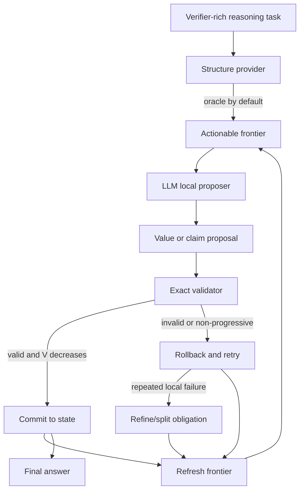

# Structured Long-Horizon Reasoning

This repository is a first-pass implementation of **transactional structured
reasoning**: instead of asking one model call to produce a long monologue, we
represent reasoning as a set of subproblems, ask the model to solve one local
subproblem at a time, validate that local update, and commit it only if it is
correct and progressive.

The narrow v1 claim is:

> Given a correct subproblem structure, transactional validation of local
> solution steps increases the likelihood of a correct final answer by
> preventing invalid or unhelpful intermediate results from entering committed
> reasoning state.

This is not a claim that long-horizon reasoning is solved. The first target is
the verifier-rich regime where the dependency graph is known and local answers
are exactly checkable.

## Why This Exists

Long chain-of-thought traces are fragile: one early arithmetic or symbolic error
can contaminate the rest of the answer. This project tests a different execution
semantics:

- decompose a task into known subproblems,
- solve one local subproblem per model call,
- validate that proposed local solution exactly,
- commit only valid, non-regressive updates,
- rollback rejected updates and retry or reschedule.

The inspiration is STRATUS/TNR-style transactional no-regression semantics, but
applied to reasoning state rather than system mitigation. The protected object is
the committed reasoning state.

## Architecture



There are three separate mechanisms:

- `StructureProvider`: decides what subproblems exist.
- `ModelClient`: proposes a solution to one currently ready subproblem.
- `SolutionValidator`: checks whether the proposed local solution is correct and
  commit-worthy.

The main experiment uses `OracleStructureProvider`, so decomposition quality is
not mixed into the primary result. `ModelVerifiedStructureProvider` exists as an
ablation for testing model-generated decomposition against the oracle graph.

## Quickstart

Install with `uv`:

```bash
uv sync --extra dev
```

Create credentials for API-backed runs:

```bash
cp .env.example .env
# then fill in OPENAI_API_KEY or another LiteLLM provider key
```

Run the tests:

```bash
uv run pytest
```

## Publish the TeX Article

The repo includes a small static publishing pipeline for Medium-importable
article pages:

```bash
uv run tex2pages docs/transactional_reasoning_theory.tex \
  --output docs/index.html \
  --canonical-url https://YOURNAME.github.io/structured-long-horizon-reasoning/
```

The output is a normal static HTML article at `docs/index.html`. It keeps LaTeX
math in the page and renders it with MathJax, so the GitHub Pages URL is the
URL to paste into Medium's importer. Do not paste a GitHub source/blob URL into
Medium.

Two deployment modes are supported:

- Local render plus Pages from `/docs`: run `uv run tex2pages`, commit
  `docs/index.html`, then configure GitHub Pages to publish from the `main`
  branch `/docs` folder.
- GitHub Actions render: configure GitHub Pages to use GitHub Actions. The
  workflow in `.github/workflows/pages.yml` renders the TeX file and deploys the
  generated `docs/` site on pushes to `main`.

Run a real API-backed transactional experiment. The CLI is API-first by default:

```bash
OPENAI_API_KEY=... uv run reasoning-eval arithmetic \
  --model litellm \
  --model-name openai/gpt-5 \
  --baseline transactional \
  --num-tasks 20 \
  --max-depth 5
```

Any LiteLLM-supported model string can be used:

```bash
uv run reasoning-eval arithmetic --model litellm --model-name gemini/gemini-1.5-pro
uv run reasoning-eval arithmetic --model litellm --model-name anthropic/claude-sonnet-4-5
```

The CLI defaults to `--temperature 1.0` because OpenAI GPT-5 rejects
`temperature=0.0` through LiteLLM. The client also normalizes GPT-5 requests to
`1.0` if a lower value is passed accidentally.

For deterministic local smoke tests without an API key:

```bash
uv run reasoning-eval arithmetic --model mock --baseline all --num-tasks 10 --max-depth 4
```

For a harder real-model smoke test, use fixed depth and the stress profile:

```bash
uv run reasoning-eval arithmetic \
  --model litellm \
  --baseline all \
  --num-tasks 5 \
  --min-depth 6 \
  --max-depth 6 \
  --depth-mode fixed \
  --profile stress \
  --max-abs-value 99
```

`--profile stress` uses long addition/subtraction trees so the expression gets
large without exploding intermediate values. Use `--profile balanced` when you
want multiplication and integer division included.

Depth grows exponentially because the generator currently builds full binary
trees. `depth=15` means `65,535` nodes per task. With `--baseline all`, each
task includes `recursive_oracle` and `transactional`, which each make roughly
one model call per node. Five depth-15 tasks therefore implies hundreds of
thousands of API calls. The CLI now prints an estimated workload and refuses
large API runs unless you pass `--force`.

For a harder but cheaper long-horizon benchmark, use a chain instead of a full
tree:

```bash
uv run reasoning-eval arithmetic \
  --model litellm \
  --baseline all \
  --num-tasks 5 \
  --min-depth 40 \
  --max-depth 40 \
  --depth-mode fixed \
  --shape chain \
  --profile balanced \
  --max-abs-value 20 \
  --max-steps 200
```

`--shape chain` makes node count linear: depth 40 has 41 nodes, not 65,535.
Direct/CoT still see one long nested expression, while recursive and
transactional baselines solve local steps.

## Word-DAG Tasks

The newer `word-dag` benchmark is closer to the intended LongCoT direction:

- the model sees a long natural-language quantitative story,
- the hidden graph is a chain of semantically meaningful stage contracts,
- direct/COT must solve the whole narrative at once,
- recursive/transactional baselines solve one validated stage at a time.

Example:

```bash
uv run reasoning-eval word-dag \
  --model litellm \
  --model-name openai/gpt-5.1 \
  --baseline all \
  --num-tasks 5 \
  --min-depth 40 \
  --max-depth 40 \
  --depth-mode fixed \
  --profile balanced \
  --max-abs-value 20 \
  --max-steps 300 \
  --max-api-calls 1500
```

For local smoke tests:

```bash
uv run reasoning-eval word-dag --model mock --baseline transactional --num-tasks 1 --min-depth 20 --max-depth 20 --depth-mode fixed
```

`word-dag` uses a linear hidden chain, so depth 80 means 81 nodes rather than
an exponential tree. This is the practical bridge between synthetic arithmetic
and LongCoT-style freeform reasoning.

## Logic-Grid Claim Tasks

`logic-grid` is the first benchmark aimed at the broader thesis: committed
reasoning state should be a set of validated claims, not only computed values.

The generator creates room-assignment logic puzzles with a unique solver-backed
answer. A local proposal is a claim:

```json
{
  "target_id": "person:Ava",
  "claim_type": "eliminate",
  "person": "Ava",
  "room": 2
}
```

The validator enumerates all assignments satisfying the public clues plus
committed claims. A claim commits only if it is entailed by every remaining
solution and decreases explicit unresolved work. Wrong or non-entailed claims
roll back. If a high-level person obligation repeatedly fails, the executor
refines it into candidate-level obligations like `candidate:Ava:2`.

Run a real API smoke test:

```bash
uv run reasoning-eval logic-grid \
  --model litellm \
  --model-name openai/gpt-5.1 \
  --baseline all \
  --num-tasks 5 \
  --size 6 \
  --max-steps 200
```

Run a deterministic local test:

```bash
uv run reasoning-eval logic-grid --model mock --baseline all --num-tasks 3 --size 5
```

Outputs are written to:

```text
results/aggregate.csv
results/traces/*.jsonl
blog_artifacts/*.png
```

## Baselines

Run all non-DSPy baselines:

```bash
uv run reasoning-eval arithmetic \
  --model litellm \
  --model-name openai/gpt-5 \
  --baseline all \
  --num-tasks 20
```

Available baselines:

- `direct`: one model call for the final answer.
- `cot`: one model call with a step-by-step prompt and parsed final answer.
- `recursive_oracle`: recursively solves the oracle DAG but has no transactional
  committed state, rollback, or progress gate.
- `transactional`: oracle structure plus local solution validation, rollback,
  retry, and progress-gated commits.
- `dspy_rlm`: optional DSPy RLM recursive baseline.

DSPy RLM is optional:

```bash
uv sync --extra dev --extra dspy
uv run reasoning-eval arithmetic --baseline dspy_rlm --model-name openai/gpt-5
```

The RLM path skips cleanly if `dspy` or Deno is unavailable.

## Formal State

A task is a rooted dependency DAG:

```text
G = (H, E, r)
```

The committed reasoning state is:

```text
s_t = (F_t, D_t, K_t, sigma_t, Pi_t, B_t)
```

Where:

- `F_t` is the actionable frontier.
- `D_t` is the set of expanded/decomposed nodes.
- `K_t` is the set of solved nodes.
- `sigma_t` maps solved node ids to committed values.
- `Pi_t` stores certificates for committed solution steps.
- `B_t` stores retry budget.

The implementation uses an action-unit potential:

```text
V(s) = unsolved_nodes(s) + unexpanded_composite_nodes(s)
```

Every accepted expansion decreases `V` by one. Every accepted local solution
decreases `V` by one. A proposal commits only if:

```text
validator(s_t, proposal) = accept
and
V(s_t + proposal) < V(s_t)
```

Otherwise the committed state is unchanged.

## What The Validator Does

The primary arithmetic validator is a **subproblem solution validator**. For a
proposed local solution:

```json
{
  "target_id": "n1",
  "executable_expression": "7 + 4",
  "inputs_used": {}
}
```

It checks:

- the target is currently actionable,
- the target is not already solved,
- all dependencies are committed,
- no uncommitted facts are used,
- the proposed value equals the exact oracle local value,
- committing the update preserves invariants,
- the action-unit potential strictly decreases.

For logic-grid tasks, the validator is a **claim validator**. It checks whether
the proposed assignment or elimination is entailed by the puzzle constraints and
the current committed claims. The committed state is then a set of certified
facts such as `assign:Ava = 3` or `eliminate:Ben:2 = true`.

Wrong local answers, premature parent solves, invented facts, and non-progressive
updates are rejected and do not enter committed state.

## Example

For:

```text
goal = ((7 + 4) * (5 - 2)) - (9 // 3)
```

The oracle graph is:

```text
n1 = 7 + 4
n2 = 5 - 2
n3 = n1 * n2
n4 = 9 // 3
goal = n3 - n4
```

If the model proposes `n1 = 12`, the solution validator rejects it as
`wrong_value`; `sigma` remains unchanged. The model can retry and later commit
`n1 = 11`. This is the core behavior: local errors do not silently poison later
reasoning.

See [docs/transactional_arithmetic_example.md](docs/transactional_arithmetic_example.md)
for the full trace.

## Metrics

Each run logs:

- final accuracy,
- accepted solution steps,
- rejected solution steps,
- accepted expansions,
- rollback count,
- accepted-step rate,
- retries consumed,
- rejection reason histogram,
- potential trajectory,
- stall and budget-exhaustion status,
- model name, baseline, structure provider, seed, depth, and node count.

## Literature

- [STRATUS / TNR](https://arxiv.org/abs/2506.02009): transaction and
  no-regression semantics.
- [DSPy RLM](https://dspy.ai/api/modules/RLM/): recursive language model
  baseline.
- [DSPy](https://dspy.ai/): model configuration and optional RLM dependencies.
- [LiteLLM](https://docs.litellm.ai/): model-call abstraction.
- [OpenAI GPT-5](https://platform.openai.com/docs/models/gpt-5): preferred
  default API model.

Additional notes are in [docs/literature.md](docs/literature.md).

## Roadmap

The v1 target is deliberately narrow. Next steps:

- run real GPT-5/LiteLLM experiments over larger depth sweeps,
- add symbolic/algebraic DAG tasks,
- evaluate `model_verified` decomposition separately,
- add LongCoT-mini math tasks where only some local checks are exact,
- introduce hybrid validators,
- formalize probabilistic false-accept and false-reject bounds,
- eventually let the model propose the structure itself without an exact oracle.
